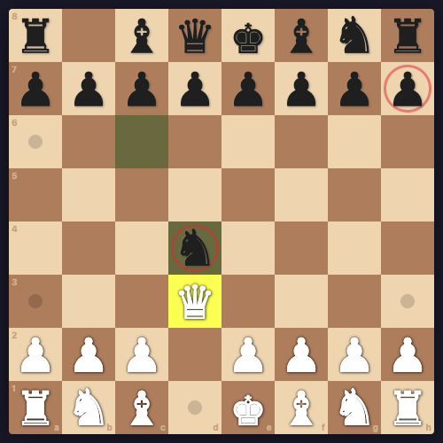
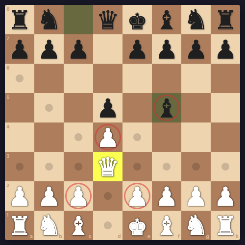
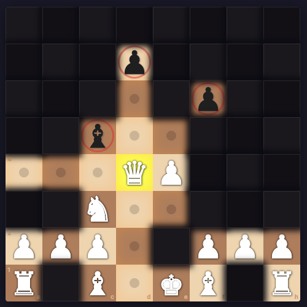
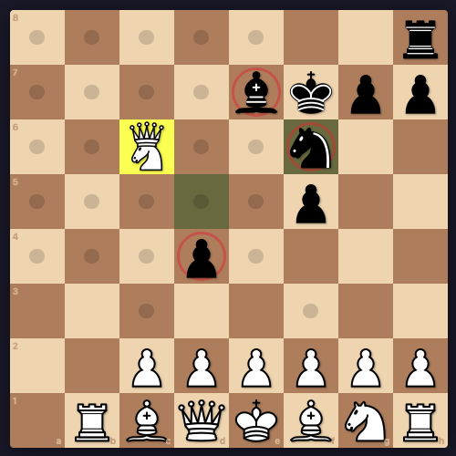
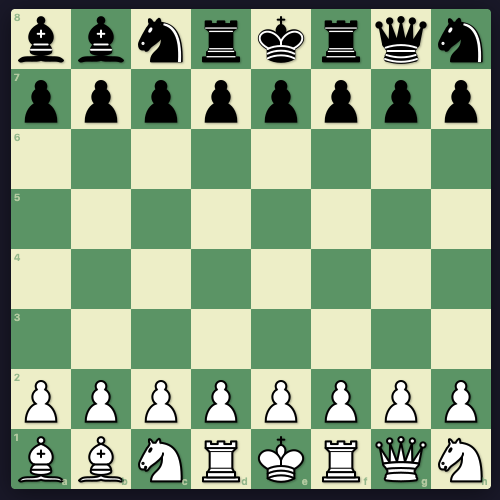

# Chess Variants

A vanilla JS progressive web app implementing chess variants with real-time multiplayer and local bot play.

**Play now at [druewilding.com/chess](https://www.druewilding.com/chess/)**

## Variants

### Ice Skate Chess
Sliding pieces (bishop, rook, queen) must travel the maximum possible distance; they cannot stop early.



### Angry Chess
Players may capture their own pieces (except the king).



### Dark Chess
Standard chess, but the board is shrouded in darkness. Tap a piece to shine a torch and reveal enemies in its path.



### Superchess

The same as standard chess, until you get to promotion, at which point you can claim an Amazon, a powerful piece combining the abilities of both a queen and a knight.



### Chess960

All variants have a **Chess960** (Fischer Random) mode, where the back rank pieces are shuffled into one of 960 possible starting positions.



## Features

- Real-time multiplayer via Firebase Realtime Database
- Bot opponent with adjustable difficulty
- Push notifications for your opponent's move
- Offline support via service worker
- Snapshot replay — step through any move in the game history

## Tech Stack

- Vanilla JS, HTML, CSS — no build step
- Firebase Realtime Database (multiplayer sync) and Cloud Functions (push notifications)
- Hosted on GitHub Pages

## Project Structure

| File                 | Responsibility                                            |
| -------------------- | --------------------------------------------------------- |
| `index.html`         | Lobby — variant picker, game creation/joining, bot launch |
| `game.html`          | Gameplay — board, move history, bot AI, Firebase sync     |
| `js/chess-engine.js` | Rules engine — move generation, legality, check/checkmate |
| `js/chess-ui.js`     | Board rendering — piece display, selection, animation     |
| `js/game-manager.js` | Firebase — game creation, real-time sync, draw offers     |
| `functions/index.js` | Cloud Function — FCM push notifications                   |

## Running Locally

```bash
cp .env.example .env
# Fill in your Firebase credentials in .env
./start.sh
```

No build step required. Multiplayer and push notifications require a Firebase project configured via `.env`.

## Deploying the Push Notification Function

The Cloud Function in [functions/index.js](functions/index.js) sends push notifications when it's a player's turn. To deploy it:

1. **Install Firebase CLI** (if not already installed):
   ```bash
   npm install -g firebase-tools
   ```

2. **Authenticate with Firebase**:
   ```bash
   firebase login
   ```

3. **Deploy the function**:
   ```bash
   firebase deploy --only functions
   ```

**Requirements:**
- Your Firebase project must have **Blaze (pay-as-you-go) billing enabled** — the Cloud Function cannot send FCM messages on the free Spark plan
- The function is deployed to `europe-west1` to match the Realtime Database region
- It triggers on writes to `games/{gameId}/lastMoveAt` and sends a data-only FCM message to the player whose turn it is

For more details, see the [functions/index.js](functions/index.js) implementation.
